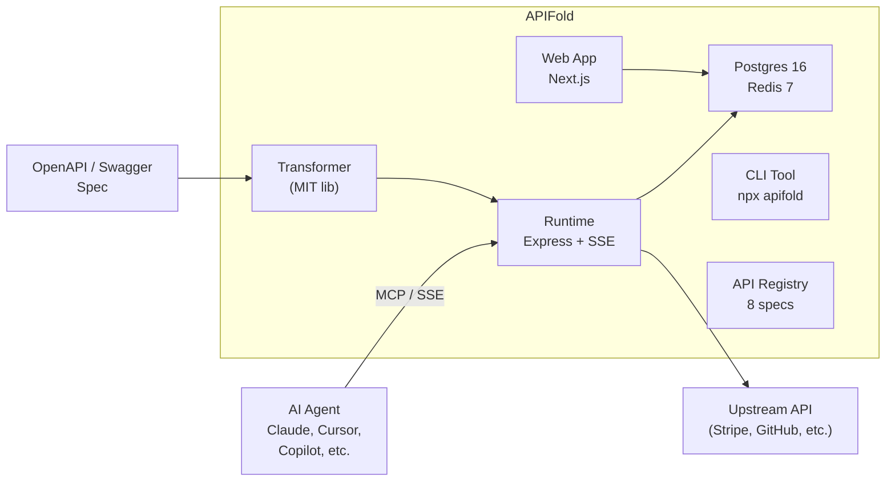

<br />
<p align="center">
    <a href="https://apifold.dev" target="_blank"></a>
    <br />
    <br />
    <b>Turn any REST API into an MCP server. No code required.</b>
    <br />
    <br />
</p>

[](https://github.com/Work90210/APIFold/actions)
[](./LICENSE)
[](./packages/transformer/LICENSE)
[](https://www.npmjs.com/package/@apifold/transformer)
[](https://nodejs.org)

APIFold reads an OpenAPI 3.x or Swagger 2.x specification and generates a live, production-ready [MCP](https://modelcontextprotocol.io) server endpoint. AI agents — Claude, Cursor, Copilot, or any MCP-compatible client — can connect immediately. Tool calls execute real HTTP requests to real upstream APIs with securely stored credentials. No stubs, no mocks, no glue code.

## Quick Start

### CLI (fastest)

```bash
npx apifold serve ./your-openapi-spec.yaml --base-url https://api.example.com
```

One command. Your spec becomes a running MCP server with SSE transport on `localhost:3000`. Connect Claude or Cursor immediately.

### From the API Registry

```bash
npx apifold serve --registry stripe --base-url https://api.stripe.com
```

Ships with 8 pre-configured API specs: Stripe, GitHub, Slack, HubSpot, Twilio, OpenAI, Notion, and Petstore.

### Hosted Platform

1. Sign up at [apifold.dev](https://apifold.dev)
2. Import a spec (URL, file upload, or browse the registry)
3. Copy the connection snippet into Claude Desktop or Cursor
4. Your MCP server is live with a unique endpoint URL

## Features

- **OpenAPI 3.x + Swagger 2.0** — auto-converts Swagger 2.0 specs transparently
- **CLI tool** — `npx apifold serve` for zero-config local MCP servers
- **API registry** — one-click deploy from 8 curated API specs
- **OAuth 2.0** — Authorization Code (PKCE), Client Credentials, 8 provider presets, auto token refresh
- **Access profiles** — tool-level permissions (Read Only / Read-Write / Full Access)
- **Analytics** — call volume, latency percentiles, error breakdown, usage quotas
- **Custom domains** — use `mcp.yourcompany.com` with DNS verification
- **Unique endpoint IDs** — cryptographic, unguessable URLs per server
- **SSE + Streamable HTTP** — both MCP transport modes supported
- **Vault encryption** — AES-256-GCM for all stored credentials
- **SSRF protection** — DNS pinning, redirect blocking, private IP rejection

## CLI

```bash
npm install -g @apifold/cli
```

| Command | Description |
|---------|-------------|
| `apifold serve <spec>` | Start an MCP server from an OpenAPI spec |
| `apifold serve --registry stripe` | Start from a registry spec |
| `apifold transform <spec>` | Output MCP tool definitions as JSON |
| `apifold validate <spec>` | Parse-only validation with warnings |
| `apifold init [spec]` | Generate an `apifold.config.yaml` template |

### Config file

```yaml
# apifold.config.yaml
spec: ./openapi/stripe.yaml
port: 3001
transport: sse
baseUrl: https://api.stripe.com
auth:
  type: bearer
  token: ${STRIPE_API_KEY}
filters:
  tags: [payments, customers]
  methods: [get, post]
```

## Self-Hosting

### Development

```bash
git clone https://github.com/Work90210/APIFold.git
cd APIFold
pnpm install
cp .env.example .env
docker compose -f infra/docker-compose.dev.yml up -d
pnpm dev
```

Open [http://localhost:3000](http://localhost:3000) to access the dashboard.

### Production

```bash
cp .env.example .env
# Edit .env with your production values
docker compose -f infra/docker-compose.yml up -d
```

## Using the Transformer Library

The core conversion logic is a standalone **MIT-licensed** npm package:

```bash
npm install @apifold/transformer
```

```typescript
import { parseSpec, transformSpec, autoConvert } from "@apifold/transformer";

// Auto-convert Swagger 2.0 if needed
const { spec } = await autoConvert(rawSpec);

// Parse and transform
const parsed = parseSpec({ spec });
const { tools } = transformSpec({ spec: parsed.spec });
// tools = MCPToolDefinition[] ready for any MCP server
```

## Architecture



| Component | Path | Description |
|-----------|------|-------------|
| **Transformer** | [`packages/transformer`](packages/transformer) | OpenAPI to MCP conversion. Pure functions. **MIT licensed.** |
| **Runtime** | [`apps/runtime`](apps/runtime) | Express MCP server with SSE/HTTP, OAuth token refresh, access profiles. |
| **Web App** | [`apps/web`](apps/web) | Next.js dashboard. Import specs, manage credentials, analytics, custom domains. |
| **CLI** | [`apps/cli`](apps/cli) | Standalone CLI tool. `npx apifold serve` for local MCP servers. |
| **Registry** | [`packages/registry`](packages/registry) | Curated catalog of 8 validated API specs with one-click deploy. |
| **Types** | [`packages/types`](packages/types) | Shared TypeScript type definitions. |
| **UI** | [`packages/ui`](packages/ui) | Design system and component library. |

## Available Commands

| Command | Description |
|---------|-------------|
| `pnpm dev` | Start all services with hot-reload |
| `pnpm build` | Build all packages |
| `pnpm test` | Run tests |
| `pnpm lint` | Lint all packages |
| `pnpm typecheck` | Type-check all packages |
| `pnpm format` | Format all files with Prettier |
| `pnpm db:migrate` | Run database migrations |
| `pnpm db:studio` | Open Drizzle Studio |

## Contributing

All code contributions must go through a pull request and be approved before merging. See the [contribution guide](docs/CONTRIBUTING.md).

Want to add an API to the registry? See [`packages/registry/CONTRIBUTING.md`](packages/registry/CONTRIBUTING.md).

## Security

For security issues, please refer to our [security policy](docs/SECURITY.md). Do not post security vulnerabilities as public GitHub issues.

## License

- **[`@apifold/transformer`](packages/transformer)** — [MIT License](packages/transformer/LICENSE)
- **Everything else** — [GNU Affero General Public License v3.0](LICENSE)
